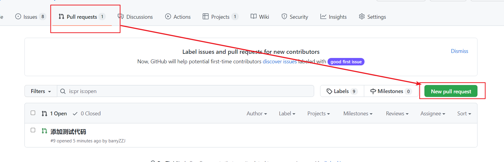

1. Pycharm：Git -> Clone...，URL里输入https://github.com/barryZZJ/RDH-EI_cqu.git
2. 本项目环境配置（参考README）
   1. 执行“生成虚拟环境.bat” （要求python在环境变量PATH里），会生成venv目录。
   2. 执行"安装依赖包.bat"
   3. 如果开发过程中安装了新的库，运行“更新依赖文件.bat”，同步给其他人。其他人执行"安装依赖包.bat"即可。
   4. pycharm配置python解释器
3. 开发（有问题来找我）
   1. 修改代码
   2. 提交到自己的分支

## 上传

4. 把自己分支上的代码改动合并到主分支 （网页里面的 pull request）（可能无法自动合并）

   

   

   

## 代码提交流程

1. 修改本地文件
2. commit（存入本地缓存，不改变远端）（跟分支无关）
3. push（把本地缓存推到远端）（选择要推到哪个分支）（可以多个commit再一并push）

## 下载

1. pycharm

2. Github Desktop

下载时是远端文件跟本地进行合并，也可能出现冲突。